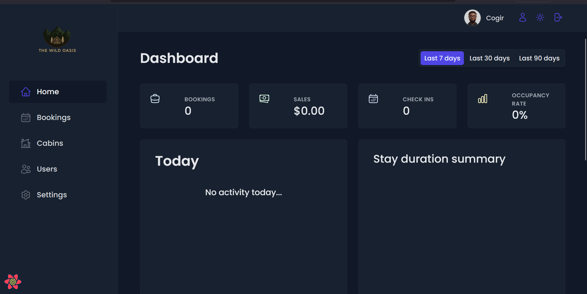
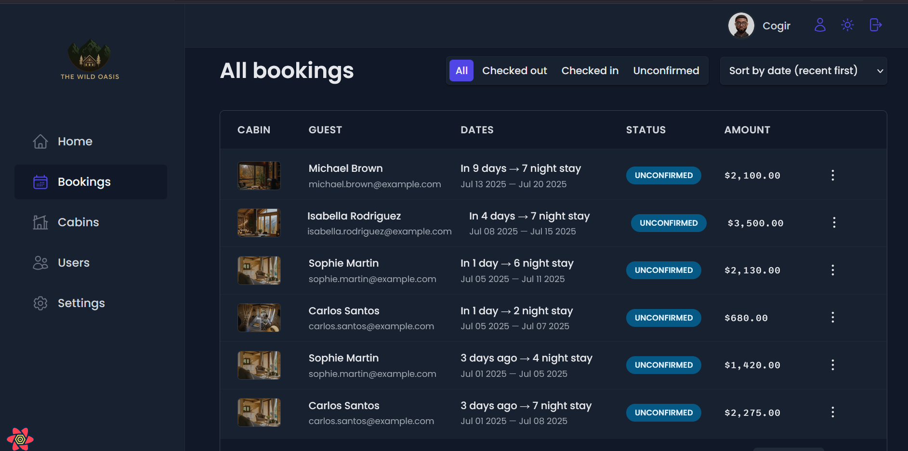
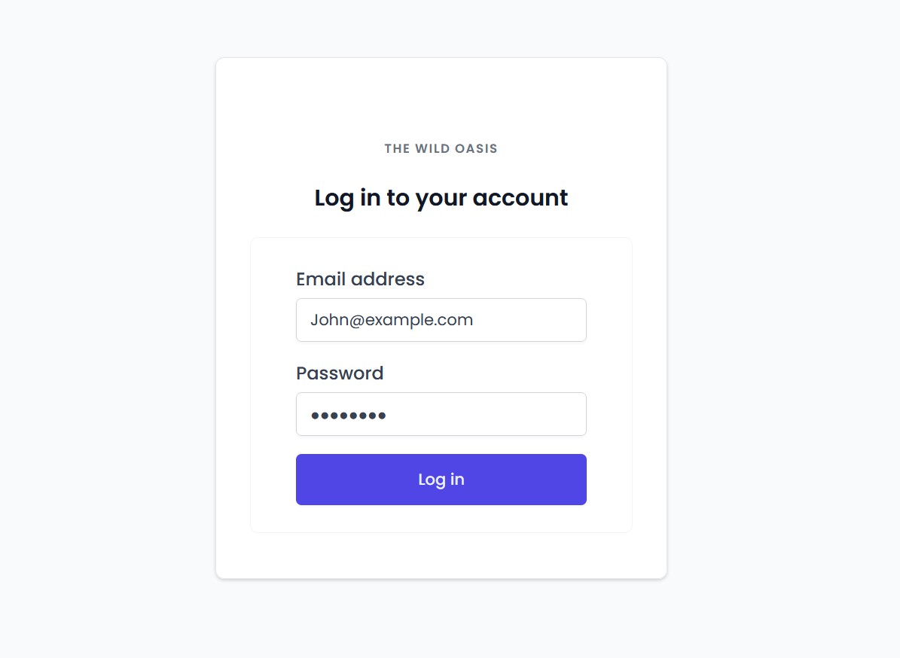

# The Wild Oasis - Hotel Management System

A modern, full-stack hotel booking and management application built with
Next.js, featuring comprehensive booking management, staff authentication, and
real-time dashboard analytics.

## 🌟 Features

### 📊 Dashboard & Analytics

- Real-time statistics on recent bookings, sales, check-ins, and occupancy rates
- Interactive charts showing daily hotel sales with breakdown of total vs.
  breakfast sales
- Guest check-in/check-out management for current day operations
- Key performance metrics for the last 7, 30, and 90 days.

### 🏨 Cabin Management

- Complete CRUD operations for cabin management
- Photo upload and management for each cabin
- Cabin details including capacity, pricing, and current discounts
- Visual cabin gallery with detailed specifications

### 📅 Booking Management

- Comprehensive booking system with status tracking ("unconfirmed",
  "checked-in", "checked-out")
- Detailed booking information including arrival/departure dates, guest data,
  and payment status
- Guest information management with full contact details and nationality
- Breakfast add-on management during check-in process
- Payment processing and confirmation workflow

### 👥 User Management

- Secure authentication system for hotel employees
- Role-based access control
- User profile management with avatar upload
- Password management and security features

### ⚙️ Application Settings

- Configurable breakfast pricing
- Flexible booking duration limits (min/max nights)
- Maximum guests per booking settings
- Dark mode toggle for enhanced user experience

## 🚀 Tech Stack

### Frontend

- **React 18** - UI library with modern hooks
- **Styled-Component** - CSS framework
- **Lucide React** - Modern icon library
- **React Router** - Client-side routing

### Backend & Database

- **Supabase** - Backend-as-a-Service with PostgreSQL
- **Supabase Auth** - Authentication and user management
- **Supabase Storage** - File and image storage

### Development Tools

- **ESLint** - Code linting and formatting
- **Git** - Version control
- **npm** - Package management

## 📱 Screenshots

### Dashboard



### Cabin Management


### Booking Overview



### User Authentication



1. **Clone the repository**

   ```bash
   git clone https://github.com/Miss-Marvis/the-wild-oasis

   ```

   Netlify live view - https://wood-craft-hotel.netlify.app

2. **Install dependencies**
   ```bash
   npm install
   ```

**Built with ❤️ by Wondikom Marvis**
